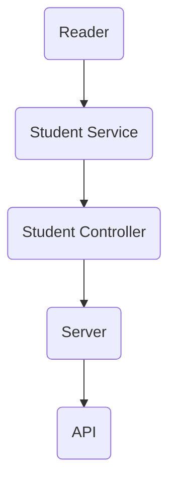
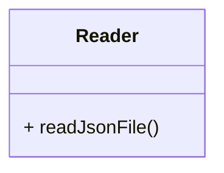
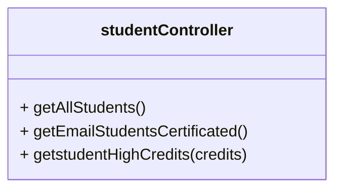
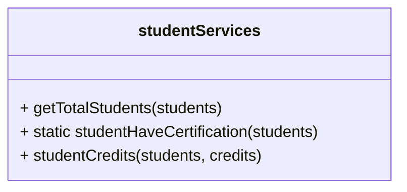

# Codechallenge Visual Thinking API By LaunchX 🚀

Este es un repositorio con la solución al codecallenge realizado para el curso en Backend con NodeJS en LaunchX impartido por [@carlogilmar](https://github.com/carlogilmar).

## __Requerimientos__ 📋

Desarollar un API con express que permita realizar consultas a una base de datos que permita acceder a diversos datos de un archivo JSON, el cual tiene una lista de objetos con varios estudiantes. El proposito general de la API es:

1. Habilitar un endpoint para consultar todos los estudiantes con todos sus campos.
2. Habilitar un endpoint para consultar los emails de todos los estudiantes que tengan certificación `haveCertification`.
3. Habilitar un endpoint para consultar todos los estudiantes que tengan `credits` mayor a 500.
   
## __Instalación__ 🛠 
Para poder visualizar este proyecto se debe tener previamente instalado `node` y `npm` para poder ejecutar `npm install`.
   
## __Dependencias__ 📦
Las dependencias ue se utilizaron en este proyecto Para este proyecto se inicio con la creación de un proyecto con `npm` con el comando `npm init` y posteriormente se instalaron las dependencias con .
- [Jest](https://jestjs.io/): Esta dependencia nos permite realizar pruebas unitarias (TDD) para comprobar que el código funciona correctamente.
- [ESLint](https://eslint.org/): Esta dependencia nos permite realizar una revisión de nuestro código para verificar que no existan errores.
- [Espress](https://expressjs.com/es/): Esta dependencia nos permite crear un servidor que nos permite realizar las consultas a nuestra API.
  
```
npm install --save-dev jest eslint express
```


## __Estructura__ 📚
Esta es la estrutura que se utilizo para el diseño de la API.


## __Solución__ 💻
Todos los pasos que se realizaron se encuentran en los commits del repositorio. 

**Reader** - Se encarga de leer el archivo JSON y retornar un objeto con los datos.



**StudentController** - Se encarga de realizar las consultas a la base de datos.

- `getAllStudents()` - *Retorna todos los estudiantes.*
- `getEmailStudentsCertificated()` - *Retorna todos los estudiantes que tengan certificación.*
- `getstudentHighCredits(credits)` - *Retorna todos los estudiantes que tengan más de 500 créditos.*



**StudentService** - Se encarga de realizar las consultas a la base de datos.
- `getTotalStudents(students)` - Retorna el total de estudiantes.
- `static studentHaveCertification(students)`
- `studentCredits(students, credits)`



## __Ejecutando las pruebas__ 🔍
Para ejecutar las pruebas de este proyecto se debe ejecutar el siguiente comando:
```
npm run test
```

## __EndPoints__ 📌
Para acceder y ver los endpoints se se debe de ejecutar el comando `npm run service` para poder realizar la consulta al servidor y ver los resultados desde el navegador o desde Postman.

|Método HTTP | Endpoint | Url | 
|---| --- | --- |
| [GET] | /v1/students | `http://localhost:3001/v1/students` |
| [GET] | /v1/students/certification/emails | `http://localhost:3001/v/students/certification/emails` |
| [GET] | /v1/students/credits/:credits | `http://localhost:3001/v1/students/credits/500` |


##  __Pruebas en Postman__ 👨‍🚀


Autor: [@EslebanPerez](https://github.com/EslebanPerez) 
